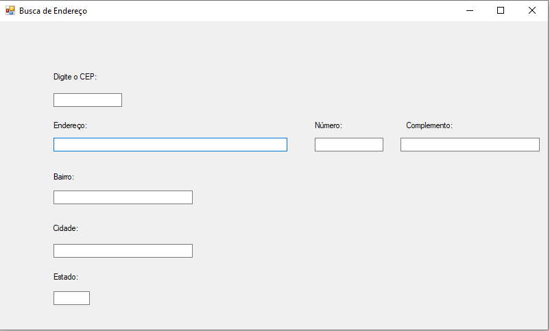
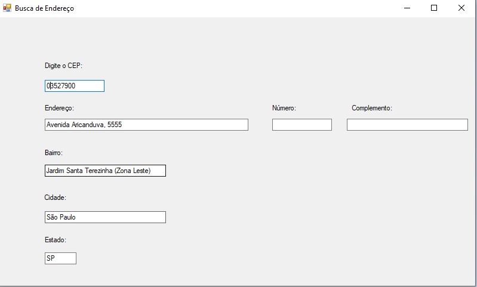
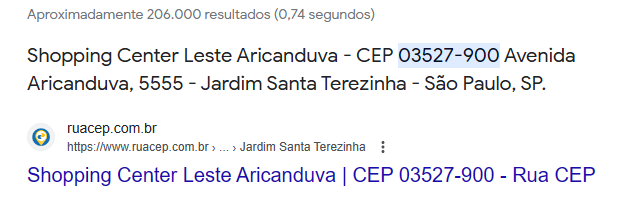

# BuscaEndereco-CSharp
um sistema no c# pra buscar endereço com serviço dos correios. feito na aula para aprender C#.
  

  <h3>Aqui eu uso o serviço dos correios pra pegar endereço automaticamente</h3>
  

 

  <h3>Aqui eu usei o CEP do shopping aricanduva e o serviço do correio trouxe as informações automaticamente.</h3>
  

